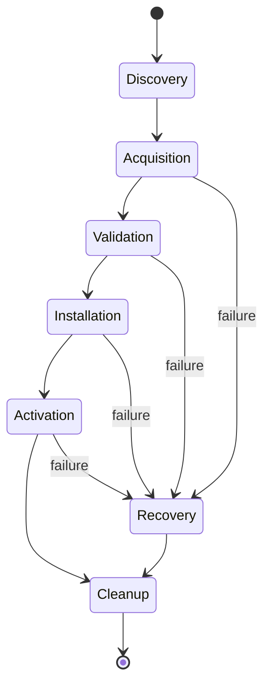
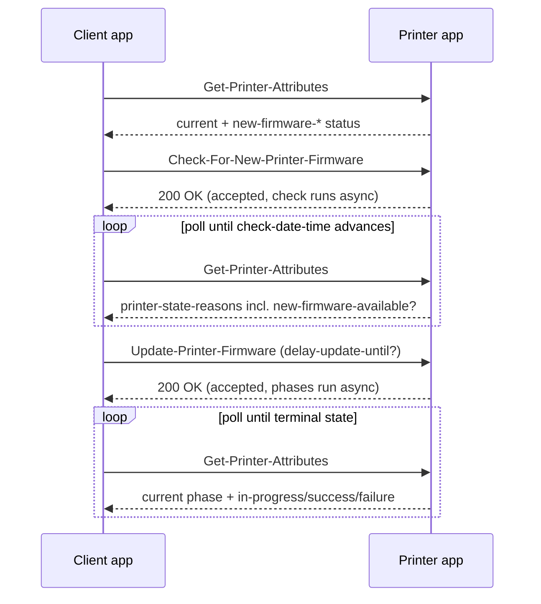

# fwupdate-prototype-dart

Prototype implementation of [IPP Firmware Update Extensions v1.0](wd-ippfwupdate10-20260729.pdf) (FWUPDATE) in Dart/Flutter.

The project is two separate Flutter apps, one per role defined by the spec's Protocol Role
Terminology (§2.3), sharing a set of plain-Dart packages:

- **Printer app** (desktop-first) — a fake IPP Printer that implements the FWUPDATE
  operations/attributes and exposes a UI to script exactly how it misbehaves (unreachable
  repository, failed install phases, auth errors, mid-update reboots, etc).
- **Client app** (mobile-first) — an IPP Client that discovers Printer-app instances on the
  LAN, drives them through the Triggered Autonomous Firmware Update flow (spec §4.1.3), and
  displays exactly what it received so a human can judge whether the Client behaved
  correctly against whatever the Printer just threw at it.

The point of the project is validation, not production firmware delivery: the Client app is
the system under test, the Printer app is the test harness for it.

## Status

v1 (Milestones 1–8 below) is implemented: the shared packages, both apps, and their
automated tests. What's *not* built is called out explicitly in Non-Goals and the remaining
Milestones (Set-Printer-Attributes, Get-Notifications, chaos mode, real TLS).

```
packages/ipp        6 tests   — wire codec + HTTP transport
packages/fwupdate   6 tests   — attributes/operations/state-reasons vocabulary
apps/printer       15 tests   — state machine + real end-to-end HTTP loopback
apps/client         5 tests   — PrinterSession driven against a real PrinterEngine
```

See [BUILD.md](BUILD.md) for prerequisites, bootstrap steps, running both apps, producing
release builds, and testing.

## Goals

- Implement the FWUPDATE model faithfully enough that a real IPP Client (the Client app
  built here, but also potentially a third-party client) can be exercised against every
  conformance-relevant behavior in the spec.
- Make every error/edge case in the spec *reachable on demand* from the Printer's UI,
  instead of only reachable by chance.
- Keep the IPP protocol layer honest (real wire encoding, real HTTP, real mDNS discovery)
  rather than mocking the transport — otherwise we're not really testing the Client.

## Non-Goals

- Real firmware files / actual device flashing. "Firmware" is a simulated blob described
  by attributes only (§3.4 Out of Scope already excludes firmware file formats).
- Full IPP/2.x job-processing (Print-Job, Validate-Job, etc). We implement only enough IPP
  to carry Get-Printer-Attributes plus the two new operations.
- Full Set-Printer-Attributes/Get-Printer-Supported-Values support in v1 (see Milestones —
  it's a stretch goal; the Printer app's own UI can already set every value those operations
  would otherwise configure).
- TLS / HTTP 426 enforcement (§5.2's "Update-Printer-Firmware MUST be sent over a secure
  connection" requirement). Deferred entirely for v1 as a deliberate scope cut — revisit as
  a future milestone if we decide the Client's reaction to a TLS-upgrade requirement needs
  validating too.

## Architecture

Two Flutter apps in one repo (a small monorepo, no melos required — plain relative `path:`
dependencies are enough at this size), sharing a set of plain-Dart packages with no Flutter
dependency so they're unit-testable and reusable from a future headless CLI if we ever want
one.

| Concern | Choice | Why |
|---|---|---|
| App split | Two independent Flutter apps (`apps/printer`, `apps/client`) sharing `packages/*` | Printer needs to advertise mDNS and accept inbound connections reliably, which mobile OSes actively fight (background suspension of listeners/Bonjour, local-network permission prompts); Client only needs foreground outbound calls + browsing, which is easy everywhere. Splitting lets each app target the platform its job is actually easy on, and a device can't accidentally be in the wrong mode during a demo. |
| Printer app platforms | macOS, Linux, Windows (desktop-first for v1) | An always-on, reliably-listening process — matches what a real printer is, and sidesteps mobile background-execution limits entirely for v1 |
| Client app platforms | iOS, Android (primary), plus macOS/Linux/Windows (free bonus — foreground-only code has no extra cost cross-platform) | Matches the spec's own use cases (Rafael's phone) and is the actual system under test |
| IPP wire encoding | Hand-rolled codec for the RFC 8010/3382 binary encoding | The subset we need (a handful of operations/attributes) is small; a full IPP package would be overkill and we need precise control to inject malformed responses in "chaos mode" |
| IPP transport | `dart:io HttpServer` (Printer app) / `dart:io HttpClient` (Client app) | IPP is HTTP POST with an `application/ipp` body; no need for a web framework |
| Discovery | [`bonsoir`](https://pub.dev/packages/bonsoir) (mDNS/DNS-SD broadcast **and** browse, cross-platform) | Printer app must be *discoverable*, not just listenable — `multicast_dns` alone only browses, it can't advertise |
| State management | `provider` + `ChangeNotifier` | Small apps, no need for Riverpod/Bloc ceremony |
| Persistence | None required for v1 (simulation config resets on launch); revisit if we want saved scenario presets across restarts |

### Package layout

```
packages/
  ipp/                         # transport-agnostic IPP protocol codec (RFC 8010/3382 subset)
    lib/
      ipp_constants.dart       # operation ids, status codes, tag bytes, out-of-band values
      ipp_value.dart           # tagged attribute values incl. out-of-band (no-value/unknown)
      ipp_message.dart         # request/response model + binary encode/decode
      ipp_client_transport.dart # sends an IppMessage over HTTP, returns an IppMessage
      ipp_server_transport.dart # HttpServer that decodes requests, dispatches, encodes responses

  fwupdate/                    # spec-specific vocabulary layered on ipp/
    lib/
      attributes.dart          # printer-new-firmware-*, delay-update-until*, repository/policy attrs
      operations.dart          # Check-For-New-Printer-Firmware / Update-Printer-Firmware (req+resp)
      state_reasons.dart       # §7.3 keyword constants + phase groupings
      status_codes.dart        # client-error-forbidden, client-error-conflicting-attributes, etc.

  discovery/                   # thin bonsoir wrapper shared by both apps
    lib/
      printer_advertiser.dart  # bonsoir broadcast: _ipp._tcp, TXT record per §11 hints
      printer_browser.dart     # bonsoir discovery for the Client app

apps/
  printer/                     # Printer app (desktop-first)
    lib/
      printer_state.dart       # live attribute values, ChangeNotifier
      firmware_state_machine.dart  # phase engine driving §4.1's Discovery→...→Cleanup/Recovery
      simulation_config.dart   # every injectable fault, as one serializable config object
      scenario_presets.dart    # named bundles of SimulationConfig (see Fault Injection Catalog)
      ui/
        printer_home_screen.dart        # current printer-state / printer-state-reasons dashboard
        simulation_control_screen.dart  # the fault-injection control panel
        request_log_screen.dart         # raw IPP requests/responses received, for debugging
      main.dart

  client/                      # Client app (mobile-first)
    lib/
      discovered_printers_screen.dart   # bonsoir browse results, tap to connect
      printer_attributes_screen.dart    # Get-Printer-Attributes viewer
      firmware_update_screen.dart       # check / configure delay / request update / progress
      identity_screen.dart              # pick simulated requesting-user-name + role (see Auth below)
      event_log_screen.dart             # raw request/response transcript
      main.dart

test/                          # or per-package test/ dirs, TBD when we scaffold
  ipp_codec_test.dart
  firmware_state_machine_test.dart
  scenario_presets_test.dart
  integration/
    loopback_test.dart         # Client + Printer app logic in one test process over localhost,
                                # drives every preset scenario and asserts on Client-visible state
```

## IPP Protocol Subset

### Operations implemented

| Operation | Opcode | Role | Notes |
|---|---|---|---|
| Get-Printer-Attributes | 0x000B | Both | Baseline STD92 op; how the Client reads status/attributes between actions |
| Check-For-New-Printer-Firmware | 0x006B | Both | §5.1 |
| Update-Printer-Firmware | 0x006C | Both | §5.2 |

`Get-Notifications` [RFC 3996] is mentioned in the spec's sequence diagram (Figure 3) as an
alternative to polling, but it's a large protocol surface on its own. **v1 uses polling only**
(Client re-issues Get-Printer-Attributes on a timer); Get-Notifications is a possible later
addition if we want to test event-driven Clients too.

### Attributes implemented

All attributes from spec §6 and the new §7.1–7.3 values, specifically:

- Operation attributes: `delay-update-until` (§6.1.1), `delay-update-until-date-time` (§6.1.2)
- Printer description: `delay-update-until-supported`, `printer-new-firmware-policy-configured`,
  `printer-new-firmware-policy-supported`, `printer-firmware-repository-uri-configured`,
  `printer-firmware-repository-uri-supported` (§6.2.1–6.2.5)
- Printer status: `printer-firmware-info-uri`, `printer-new-firmware-check-date-time`,
  `printer-new-firmware-delayed-until(-date-time)`, `printer-new-firmware-info-uri`,
  `printer-new-firmware-k-octets`, `-name`, `-patches`, `-string-version`, `-urgency`,
  `-version` (§6.3.1–6.3.11)
- `ipp-features-supported` gains `'fwupdate'` (§7.1); `operations-supported` gains the two
  new enum values (§7.2); `printer-state-reasons` gains all 22 keywords from §7.3.

Existing STD92 attributes needed to host the above: `printer-state`, `printer-state-reasons`,
`printer-is-accepting-jobs`, `printer-current-time`, `printer-uri-supported`, plus the
`printer-firmware-*` attributes from [PWG 5100.13] that the new `printer-new-firmware-*`
attributes are defined to parallel (Table 1) — the Printer needs *both* the "currently
installed" and "newly available" firmware attribute families to make the before/after
distinction visible in the Client UI.

`Set-Printer-Attributes` / `Get-Printer-Supported-Values` [RFC 3380] (§4.5, §4.6) are **not**
implemented in v1 — the Printer app's Simulation Control screen sets
`printer-firmware-repository-uri-configured` and `printer-new-firmware-policy-configured`
directly (as if a human walked up to the printer), rather than over IPP. Adding
Set-Printer-Attributes later would let us test a Client that *configures* the printer
remotely, which is a real but separate feature from firmware-update testing.

## Discovery

The Printer app advertises `_ipp._tcp.local` via `bonsoir`, with TXT record keys `txtvers`,
`rp` (empty), `ty` (a name like "FWUPDATE Sim Printer — <scenario>"), and `note` set to the
currently active scenario name so it's identifiable in a device list without connecting
first. The Client app browses that service type and lists results with live TXT-record
updates (so switching scenarios on the Printer updates the Client's list without a manual
refresh).

TLS is out of scope for v1 (see Non-Goals) — everything runs over plain `_ipp._tcp`/HTTP.

## Printer App Design

### Firmware phase state machine

Drives directly from Figure 1 of the spec:



Each phase after Discovery emits the corresponding `printer-state-reasons` keyword triple
(`-in-progress` → `-success` or `-failure`, §7.3.5–7.3.22) as it runs, and the engine holds
in `-in-progress` for a configurable duration per phase so the Client's polling loop has
something to observe. `Recovery` is only entered if the phase that failed is configured to
fail; otherwise it's skipped exactly as the diagram shows.

Discovery itself is driven by `Check-For-New-Printer-Firmware` (§5.1) or by the printer's
own autonomous policy (§4.6); the rest of the pipeline is driven by `Update-Printer-Firmware`
(§5.2) or autonomously if `printer-new-firmware-policy-configured` is `'auto'`.

### Simulation Config

One object holds every injectable fault, editable live from Simulation Control:

- **Firmware availability**: none / available, with editable `name`, `version`,
  `string-version`, `patches`, `k-octets`, `urgency`, `support-uri`
- **Repository reachability**: reachable / `firmware-repository-unreachable` /
  `firmware-repository-access-error`
- **Clock state**: normal / unset (forces `unknown` per the §6.3.2 note)
- **Never-checked**: force all `printer-new-firmware-*` back to `no-value`, as if the
  printer just booted
- **Per-phase outcome** (Acquisition, Validation, Installation, Activation, Cleanup):
  succeed / fail / hang (never completes, to test Client timeout handling)
- **Per-phase duration**: seconds to remain `-in-progress` before resolving
- **Mid-update unreachability**: simulate a reboot by refusing/dropping connections for N
  seconds during Activation (per the spec's explicit note in §4.4/§5.2 that this can happen)
- **Auth enforcement**: off / require Operator-or-Administrator (§5.1, §5.2), returning
  `client-error-forbidden`, `client-error-not-authenticated`, or `client-error-not-authorized`
  depending on the simulated identity the Client sent (see Identity below)
- **Delay handling**: honor `delay-update-until` / `delay-update-until-date-time` normally,
  or reject a specific `delay-update-until` keyword as unsupported (exercises the Group 3
  unsupported-attributes path, §5.2.1)
- **Conflicting-attributes check**: whether to enforce the MUST NOT-both rule for the two
  delay attributes (§4.4), returning `client-error-conflicting-attributes`
- **Operation availability**: let either new operation be entirely absent from
  `operations-supported`, to test a Client talking to a non-FWUPDATE printer
- **Policy**: `printer-new-firmware-policy-configured` = `auto` / `check` / `directed` /
  `download` (§4.6, Table 3) — controls whether the Printer starts phases on its own between
  Client requests
- **Chaos mode** (stretch): truncate/corrupt the IPP response body to test Client robustness
  against non-conformant printers — flagged separately since it's testing beyond the spec's
  own conformance requirements, not against them

### Scenario presets

Manually flipping a dozen toggles for a common test case is tedious, so Simulation Control
offers named one-tap presets on top of the raw config (still editable afterward):

| Preset | What it sets |
|---|---|
| Happy path — security update | Firmware available, urgency `security`, all phases succeed with realistic delays |
| No update available | Repository reachable, no new firmware |
| Repository unreachable | `firmware-repository-unreachable` |
| Repository access error | `firmware-repository-access-error` (reachable, download fails) |
| Never checked | All `printer-new-firmware-*` at `no-value`, no state-reason present |
| Clock not set | `printer-new-firmware-check-date-time` reports `unknown` |
| Acquisition fails | Acquisition phase fails, Recovery runs, Cleanup succeeds |
| Installation fails, no recovery configured | Installation fails, Recovery itself fails |
| Reboot mid-activation | Printer goes unreachable for 20s during Activation |
| Unauthorized Client | Auth enforcement on, Client sends End-User identity → `client-error-not-authorized` |
| Delayed install, indefinite | Client requests `delay-update-until: indefinite`, Printer holds at `new-firmware-installation-delay-until-specified` |
| Operation not supported | Both new operations removed from `operations-supported` |

### Identity / role simulation

The spec ties authorization to "Authenticated User" role (Operator/Administrator vs plain
End User, §2.2) but leaves the actual authentication mechanism to STD92/deployment. For a
prototype without a real credential store, the Client app's Identity screen lets the tester
pick a simulated identity (`requesting-user-name` value plus a role tag: Administrator /
Operator / End User / Unauthenticated) sent via HTTP Basic Auth; the Printer app's auth
enforcement toggle checks that role against a simple allow-list (Operator/Administrator
allowed, else the configured rejection status code). This is enough to validate the
Client's handling of all three documented rejection codes without building real auth.

## Client App Design

1. **Discover** — list of `_ipp(s)._tcp` instances found via `bonsoir`, showing name,
   host:port, and (if advertised) the active scenario note.
2. **Connect** — Get-Printer-Attributes on select; shows full attribute set including every
   `printer-new-firmware-*` value and current `printer-state-reasons`, with out-of-band
   values (`no-value`/`unknown`) rendered distinctly from real values so it's obvious which
   case is in play.
3. **Check for firmware** — sends Check-For-New-Printer-Firmware, then polls
   Get-Printer-Attributes on an interval until `printer-new-firmware-check-date-time`
   advances, surfacing the result (available / not available / repository error / unknown).
4. **Request update** — lets the tester pick immediate / named delay (§6.1.1 keyword) /
   specific date-time (§6.1.2), sends Update-Printer-Firmware, then polls and renders the
   live phase (`-in-progress` → `-success`/`-failure`) as a progress indicator, including
   correctly handling the printer going temporarily unreachable (must retry, not treat as
   a fatal error, per §4.4's explicit note).
5. **Event log** — every raw IPP request/response (decoded, human-readable) for the current
   session, so a discrepancy between "what the Client displayed" and "what the Printer
   actually sent" is diagnosable immediately.

### Client conformance checklist (what we're actually validating)

Derived from §8.2 plus the behavioral notes in §11:

- [ ] Handles all three out-of-band value states (real value / `no-value` / `unknown`) for
      every `printer-new-firmware-*` attribute without crashing or showing a bogus value
- [ ] Surfaces `firmware-repository-unreachable` / `-access-error` distinctly from "no update
      available"
- [ ] Never sends both `delay-update-until` and `delay-update-until-date-time` together
- [ ] Treats a mid-update connection failure as transient (keeps polling / retries) rather
      than immediately reporting update failure
- [ ] Displays `printer-firmware-info-uri` / `printer-new-firmware-info-uri` as clickable
      links adjacent to the relevant firmware info (§11 recommendation)
- [ ] Correctly surfaces the three auth rejection codes with actionable messaging
- [ ] Degrades gracefully when `operations-supported` lacks the FWUPDATE operations

## Sequence diagram (Triggered Autonomous Firmware Update)

Reproduces Figure 3 in terms of this project's two apps:



## Testing Strategy

- **Unit tests**: IPP codec round-trips (including out-of-band values and multi-value
  attributes), state machine transitions per scenario config, preset correctness.
- **Loopback integration test**: both apps' logic instantiated in the same test process
  bound to localhost, driving every scenario preset end-to-end and asserting on
  Client-visible attribute/state values — this is the fast, CI-friendly way to catch
  regressions on either side without needing two devices.
- **Manual multi-device testing**: the actual point of the project — the Printer app on a
  desktop machine and the Client app on a phone/simulator on the same LAN, to validate real
  mDNS discovery and real HTTP behavior (including the reboot-simulation unreachability
  window, which a same-process test can't meaningfully represent).

## Implementation Milestones

1. `packages/ipp` codec + loopback HTTP transport, unit-tested against hand-built byte fixtures
2. Printer app: static attribute set (no simulation yet) + Get-Printer-Attributes only
3. Printer app: firmware state machine + Check-For-New-Printer-Firmware /
   Update-Printer-Firmware, manual-only (no UI) driven by tests
4. Discovery (`packages/discovery`, bonsoir advertise/browse) wired into both apps
5. Client app UI: discover → connect → attributes → check → update → poll, happy path only
6. Printer app UI: Simulation Control screen wired to the full config, presets
7. Auth enforcement paths, both sides
8. Event/request log screens on both sides
9. *(stretch)* Set-Printer-Attributes / Get-Printer-Supported-Values for remote repository
   and policy configuration
10. *(stretch)* Get-Notifications-based Client as an alternative to polling
11. *(stretch)* Chaos mode (malformed responses)
12. *(stretch)* TLS / HTTP 426 enforcement, with a real self-signed-cert HTTPS listener on
    the Printer app and a shared test root CA, if we later decide the Client's reaction to a
    TLS-upgrade requirement is worth validating

## Decisions

- **Two apps, not one.** `apps/printer` (desktop-first: macOS/Linux/Windows) and
  `apps/client` (mobile-first: iOS/Android, plus desktop) share `packages/ipp`,
  `packages/fwupdate`, and `packages/discovery`. Rationale: Printer needs a reliably
  running listener/advertiser, which mobile OSes are hostile to; Client only needs
  foreground discovery + outbound calls, which is easy everywhere. Splitting also means a
  device can't be caught in the wrong mode mid-demo.
- **TLS/HTTP 426 enforcement is out of scope for v1**, not just simplified — see Non-Goals
  and Milestone 12. Everything runs over plain `_ipp._tcp`/HTTP for now.
